# RIAL Sitemap & Navigation

> Mapa visual de las pantallas de RIAL y cómo se navega entre ellas.
> **Lectura crítica** para cualquier developer nuevo: la app **no usa React Router**.
> Todo el routing es state-based y vive en `App.tsx` + `NavigationContext`.

---

## 1. Por qué state-based, no React Router

- **Bundle**: Vite + React 19 con state-based pesa menos que con React Router (sin overhead de matcher de rutas).
- **Capacitor**: la app se shipea como WebView en iOS/Android. URLs no son la unidad mental — los usuarios no escriben `/recipes/123`. Todo es navegación gestural.
- **Simplicidad de prototipo**: pasamos de 0 a 1 con esto, y no hay que migrar URLs si el flujo cambia.

**Trade-off conocido**: no hay deep-linking nativo. Si en el futuro queremos compartir `https://rial.app/r/<id>`, habrá que añadir un router (decisión grande, fuera de scope hoy).

---

## 2. Mecánica de navegación

```
src/App.tsx
  ├── currentScreen: string           ← qué pantalla pinta
  ├── previousScreen: string          ← para goBack()
  ├── scrollCaptureRef                ← guarda scrollY antes de salir
  └── useLayoutEffect → restaura scroll en goBack

src/contexts/NavigationContext.tsx
  ├── navigateTo(screen, params?)     ← push: previous = current; current = screen
  ├── goBack()                        ← pop: current = previous (con scroll restored)
  └── navigateToRecipe(recipeId)      ← shorthand: navigateTo('recipe-detail', { recipeId })
```

**Reglas**:
- `navigateTo` siempre captura `scrollY` síncronamente antes de cambiar `currentScreen`.
- `goBack` **restaura** el scrollY (Fase 2 scroll, sprints `[1.5.104–107]`).
- `goBack` desde `recipe-detail` con `recipeId` distinto al actual → push, no pop (caso drill-down receta-a-receta dentro de la misma pantalla).

---

## 3. Mapa de pantallas (37 screens)

Fuente de verdad: [src/config/routes.ts](../src/config/routes.ts).

```mermaid
graph TD
    Root["App.tsx<br/>currentScreen state"]

    subgraph Tabs["Bottom Nav (4 tabs)"]
        Hoy[home]
        Cocina[cocina]
        Explorar[explore]
        Mas[more]
    end

    Root --> Tabs

    subgraph HomeFlow["Tab: Hoy"]
        Hoy --> AddMeal[add-meal]
        Hoy --> AddTolerance[add-tolerance]
        Hoy --> DailyCheckIn[daily-check-in]
        Hoy --> WeeklyCheckIn[weekly-check-in]
        Hoy --> Progress[progress]
    end

    subgraph CocinaFlow["Tab: Cocina"]
        Cocina --> RecipeDetail[recipe-detail]
        Cocina --> CreateRecipe[create-recipe]
        Cocina --> ImportRecipeURL[import-url]
        Cocina --> Pantry[pantry]
        RecipeDetail --> RecipeDetail
        RecipeDetail --> CreateRecipe
    end

    subgraph ExploreFlow["Tab: Explorar"]
        Explorar --> Discovery[discovery sub-tab]
        Explorar --> Social[social sub-tab]
        Explorar --> Creators[creators sub-tab]
        Discovery --> RecipeDetail
        Social --> PostDetail[post-detail]
        Social --> StoryViewer[story-viewer]
        Social --> CreatePost[create-post]
        Social --> CreateStory[create-story]
        Creators --> CreatorProfile[creator-profile]
        Creators --> Challenges[challenges]
        Challenges --> ChallengeDetail[challenge-detail]
    end

    subgraph MoreFlow["Tab: Mas"]
        Mas --> Profile[profile]
        Mas --> Settings[settings]
        Mas --> RealFeelDiary[real-feel-diary]
        Mas --> FastingTimer[fasting-timer]
        Mas --> AICoach[ai-coach]
        Mas --> RialPlus[rial-plus]
        Mas --> Notifications[notifications]
        Mas --> CreatorVerification[creator-verification]
        Mas --> CreatorDashboard[creator-dashboard]
        Mas --> FoodDictionary[food-dictionary]
        FoodDictionary --> FoodDetail[food-detail]
    end

    subgraph Auth["Auth flow (overlay)"]
        Login[login]
        Signup[signup]
        ForgotPassword[forgot-password]
        Login -.->|signup link| Signup
        Login -.->|forgot link| ForgotPassword
    end

    subgraph Legal["Legal (overlay)"]
        PrivacyPolicy[privacy-policy]
        TermsOfService[terms-of-service]
    end

    Settings --> PrivacyPolicy
    Settings --> TermsOfService
    Profile -.->|sign out| Login
```



---

## 4. Flujos críticos

### 4.1 Drill-down a receta y vuelta con scroll

```
Cocina (scrollY=420)
  ↓ user taps RecipeCard
  navigateTo('recipe-detail', { recipeId: 'r-42' })
    → scrollCaptureRef.set('cocina', 420)
    → currentScreen = 'recipe-detail'
RecipeDetail (recipe r-42)
  ↓ user taps related recipe
  navigateToRecipe('r-99')   ← MISMA pantalla, distinto recipeId → push
    → scrollCaptureRef.set('recipe-detail', currentScrollY)
    → currentScreen sigue 'recipe-detail', recipeId pasa a 'r-99'
RecipeDetail (recipe r-99)
  ↓ user taps back
  goBack()
    → currentScreen = 'recipe-detail' (recipeId 'r-42')
    → useLayoutEffect aplica scrollY guardado
RecipeDetail (recipe r-42, scroll restored)
  ↓ user taps back
  goBack()
    → currentScreen = 'cocina'
    → useLayoutEffect aplica scrollY=420
Cocina (scroll restored at 420) ✓
```

### 4.2 First-time user → onboarding → home

```
App load
  ↓
isFirstTime === true ?
  ├─ YES → OnboardingWizard (5 steps, sin nav bar)
  │         step1: goal → step2: body → step3: macros → step4: theme → step5: name
  │         finish → setIsFirstTime(false) → currentScreen='home'
  └─ NO  → currentScreen='home' (4-tab nav visible)
```

### 4.3 Auth (cuando Supabase está activo)

```
Settings → "Mi Cuenta"
  ↓
isAuthenticated ?
  ├─ NO → Login screen
  │        ├─ login OK → useAuth() trigger → pull-on-sign-in (Q6) → Settings
  │        └─ signup link → Signup → email confirm → Login
  └─ YES → Mi Cuenta panel (sign out, delete account, sync status)
```

---

## 5. Modal vs full screen

RIAL no diferencia "modal" y "full screen" a nivel de routing — todos son `currentScreen` strings. La diferencia es **visual**:

| Tipo | Ejemplo | Diferencia visual |
|---|---|---|
| **Tab screen** | `home`, `cocina`, `explore`, `more` | Bottom nav visible |
| **Drill-down** | `recipe-detail`, `food-detail`, `post-detail` | Bottom nav oculto, header con back button |
| **Modal-like** | `add-meal`, `create-recipe`, `daily-check-in` | Bottom nav oculto, full screen, suele cerrar a la previa |
| **Overlay** | `cook-mode` | Full-screen oscuro, no usa `currentScreen` (overlay state aparte) |
| **Bottom sheet** | Filtros, edición rápida | NO es un screen, es un componente `<BottomSheet>` con `isOpen` local |

**Regla**: si necesitas history + back, es un `currentScreen`. Si es efímero (cierra al confirmar), es un BottomSheet o un modal local.

---

## 6. Cómo añadir una pantalla nueva

1. Lee primero [docs/NEW-SCREEN-CHECKLIST.md](./NEW-SCREEN-CHECKLIST.md). Es **obligatorio**.
2. Crea el archivo en `src/features/<dominio>/screens/MiScreen.tsx`.
3. Regístralo en [src/config/routes.ts](../src/config/routes.ts) (lazy import).
4. Añade el `currentScreen` literal a la unión de tipos en `NavigationContext` si aplica.
5. Si es navegable desde menú, añade el entry en `BottomNav` / `Sidebar` / `More`.
6. i18n: añade keys ES + EN. Corre `npm run check:i18n`.
7. Test convenciones: `npm run lint:code` (design-system rules + ADRs).

---

## 7. Para diseñadores

- **Bottom nav** vive en `src/features/home/components/BottomNav.tsx`. Es 4 items + un FAB central.
- **Header pattern**: cada screen drill-down tiene su propio header con back button. No hay AppBar global.
- **Transiciones**: hoy son instantáneas (no animadas). Si quieres animar, hazlo a nivel de la screen (Framer Motion ya está como `motion`).
- **Safe areas**: gestionadas por Capacitor — no debes preocuparte de notch/dynamic island salvo que diseñes overlays full-bleed.
